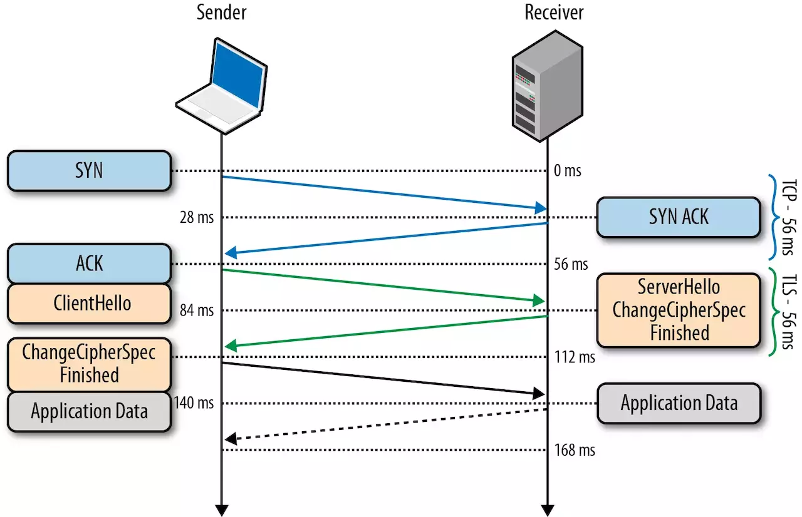
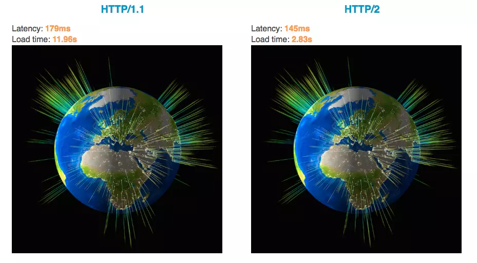
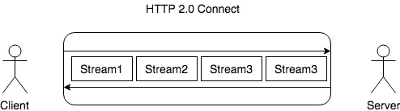

# [Http](https://baike.baidu.com/item/http/243074?fr=aladdin) 协议

> HTTP是一个简单的请求-响应协议，它通常运行在TCP之上。它指定了客户端可能发送给服务器什么样的消息以及得到什么样的响应。请求和响应消息的头以ASCII码形式给出；而消息内容则具有一个类似MIME的格式。这个简单模型是早期Web成功的有功之臣，因为它使得开发和部署是那么的直截了当。

HTTP 请求由三部分构成，分别为：

- 请求行
- 首部
- 实体

请求行大概长这样 `GET /images/logo.gif HTTP/1.1`，基本由请求方法、URL、协议版本组成，这其中值得一说的就是请求方法了。

请求方法分为很多种，最常用的也就是 `Get` 和 `Post` 了。虽然请求方法有很多，但是更多的是传达一个语义，而不是说 `Post` 能做的事情 `Get` 就不能做了。如果你愿意，都使用 `Get` 请求或者 `Post` 请求都是可以的。更多请求方法的语义描述可以阅读 [文档](https://link.juejin.im/?target=https%3A%2F%2Fdeveloper.mozilla.org%2Fzh-CN%2Fdocs%2FWeb%2FHTTP%2FMethods)。

## Post 和 Get 的区别？

先引入副作用和幂等的概念。

副作用指对服务器上的资源做改变，搜索是无副作用的，注册是副作用的。

幂等指发送 M 和 N 次请求（两者不相同且都大于 1），服务器上资源的状态一致，比如注册 10 个和 11 个帐号是不幂等的，对文章进行更改 10 次和 11 次是幂等的。因为前者是多了一个账号（资源），后者只是更新同一个资源。

在规范的应用场景上说，Get 多用于无副作用，幂等的场景，例如搜索关键字。Post 多用于副作用，不幂等的场景，例如注册。

在技术上说：

- Get 请求能缓存，Post 不能
- Post 相对 Get 安全一点点，因为Get 请求都包含在 URL 里（当然你想写到 `body` 里也是可以的），且会被浏览器保存历史纪录。Post 不会，但是在抓包的情况下都是一样的。
- URL有长度限制，会影响 Get 请求，但是这个长度限制是浏览器规定的，不是 [RFC](https://baike.baidu.com/item/RFC/1840?fr=aladdin) 规定的
- Post 支持更多的编码类型且不对数据类型限制

## 首部

首部分为请求首部和响应首部，并且部分首部两种通用，接下来我们就来学习一部分的常用首部。

**通用首部**

|     通用字段      |                      作用                       |
| :---------------: | :---------------------------------------------: |
|   Cache-Control   |                 控制缓存的行为                  |
|    Connection     | 浏览器想要优先使用的连接类型，比如 `keep-alive` |
|       Date        |                  创建报文时间                   |
|      Pragma       |                    报文指令                     |
|        Via        |               代理服务器相关信息                |
| Transfer-Encoding |                  传输编码方式                   |
|      Upgrade      |               要求客户端升级协议                |
|      Warning      |              在内容中可能存在错误               |

**请求首部**

|      请求首部       |                作用                |
| :-----------------: | :--------------------------------: |
|       Accept        |        能正确接收的媒体类型        |
|   Accept-Charset    |         能正确接收的字符集         |
|   Accept-Encoding   |      能正确接收的编码格式列表      |
|   Accept-Language   |        能正确接收的语言列表        |
|       Expect        |        期待服务端的指定行为        |
|        From         |           请求方邮箱地址           |
|        Host         |            服务器的域名            |
|      If-Match       |          两端资源标记比较          |
|  If-Modified-Since  | 本地资源未修改返回 304（比较时间） |
|    If-None-Match    | 本地资源未修改返回 304（比较标记） |
|     User-Agent      |             客户端信息             |
|    Max-Forwards     |    限制可被代理及网关转发的次数    |
| Proxy-Authorization |      向代理服务器发送验证信息      |
|        Range        |        请求某个内容的一部分        |
|       Referer       |    表示浏览器所访问的前一个页面    |
|         TE          |            传输编码方式            |

**响应首部**

|      响应首部      |            作用            |
| :----------------: | :------------------------: |
|   Accept-Ranges    |   是否支持某些种类的范围   |
|        Age         | 资源在代理缓存中存在的时间 |
|        ETag        |          资源标识          |
|      Location      |   客户端重定向到某个 URL   |
| Proxy-Authenticate |  向代理服务器发送验证信息  |
|       Server       |         服务器名字         |
|  WWW-Authenticate  |   获取资源需要的验证信息   |

**实体首部**

|     实体首部     |              作用              |
| :--------------: | :----------------------------: |
|      Allow       |       资源的正确请求方式       |
| Content-Encoding |         内容的编码格式         |
| Content-Language |         内容使用的语言         |
|  Content-Length  |       request body 长度        |
| Content-Location |       返回数据的备用地址       |
|   Content-MD5    | Base64加密格式的内容 MD5检验值 |
|  Content-Range   |         内容的位置范围         |
|   Content-Type   |         内容的媒体类型         |
|     Expires      |         内容的过期时间         |
|  Last_modified   |       内容的最后修改时间       |

### 常见状态码

状态码表示了响应的一个状态，可以让我们清晰的了解到这一次请求是成功还是失败，如果失败的话，是什么原因导致的，当然状态码也是用于传达语义的。如果胡乱使用状态码，那么它存在的意义就没有了。

状态码通常也是一道常考题。

**2XX 成功**

- 200 OK，表示从客户端发来的请求在服务器端被正确处理
- 204 No content，表示请求成功，但响应报文不含实体的主体部分
- 205 Reset Content，表示请求成功，但响应报文不含实体的主体部分，但是与 204 响应不同在于要求请求方重置内容
- 206 Partial Content，进行范围请求

**3XX 重定向**

- 301 moved permanently，永久性重定向，表示资源已被分配了新的 URL
- 302 found，临时性重定向，表示资源临时被分配了新的 URL
- 303 see other，表示资源存在着另一个 URL，应使用 GET 方法获取资源
- 304 not modified，表示服务器允许访问资源，但因发生请求未满足条件的情况
- 307 temporary redirect，临时重定向，和302含义类似，但是期望客户端保持请求方法不变向新的地址发出请求

**4XX 客户端错误**

- 400 bad request，请求报文存在语法错误
- 401 unauthorized，表示发送的请求需要有通过 HTTP 认证的认证信息
- 403 forbidden，表示对请求资源的访问被服务器拒绝
- 404 not found，表示在服务器上没有找到请求的资源

**5XX 服务器错误**

- 500 internal sever error，表示服务器端在执行请求时发生了错误
- 501 Not Implemented，表示服务器不支持当前请求所需要的某个功能
- 503 service unavailable，表明服务器暂时处于超负载或正在停机维护，无法处理请求

## TLS

HTTPS 还是通过了 HTTP 来传输信息，但是信息通过 TLS 协议进行了加密。

TLS 协议位于传输层之上，应用层之下。首次进行 TLS 协议传输需要两个 RTT ，接下来可以通过 Session Resumption 减少到一个 RTT。

在 TLS 中使用了两种加密技术，分别为：对称加密和非对称加密。

**对称加密**：

对称加密就是两边拥有相同的秘钥，两边都知道如何将密文加密解密。

这种加密方式固然很好，但是问题就在于如何让双方知道秘钥。因为传输数据都是走的网络，如果将秘钥通过网络的方式传递的话，一旦秘钥被截获就没有加密的意义的。

**非对称加密**：

有公钥私钥之分，公钥所有人都可以知道，可以将数据用公钥加密，但是将数据解密必须使用私钥解密，私钥只有分发公钥的一方才知道。

这种加密方式就可以完美解决对称加密存在的问题。假设现在两端需要使用对称加密，那么在这之前，可以先使用非对称加密交换秘钥。

简单流程如下：首先服务端将公钥公布出去，那么客户端也就知道公钥了。接下来客户端创建一个秘钥，然后通过公钥加密并发送给服务端，服务端接收到密文以后通过私钥解密出正确的秘钥，这时候两端就都知道秘钥是什么了。

**TLS 握手过程如下图：**

客户端发送一个随机值以及需要的协议和加密方式。

服务端收到客户端的随机值，自己也产生一个随机值，并根据客户端需求的协议和加密方式来使用对应的方式，并且发送自己的证书（如果需要验证客户端证书需要说明）

客户端收到服务端的证书并验证是否有效，验证通过会再生成一个随机值，通过服务端证书的公钥去加密这个随机值并发送给服务端，如果服务端需要验证客户端证书的话会附带证书

服务端收到加密过的随机值并使用私钥解密获得第三个随机值，这时候两端都拥有了三个随机值，可以通过这三个随机值按照之前约定的加密方式生成密钥，接下来的通信就可以通过该密钥来加密解密

通过以上步骤可知，在 TLS 握手阶段，两端使用非对称加密的方式来通信，但是因为非对称加密损耗的性能比对称加密大，所以在正式传输数据时，两端使用对称加密的方式通信。

PS：以上说明的都是 TLS 1.2 协议的握手情况，在 1.3 协议中，首次建立连接只需要一个 RTT，后面恢复连接不需要 RTT 了。

## 总结

总结一下内容：

- HTTP 经常考到的内容包括：请求方法、首部的作用以及状态码的含义
- TLS 中经常考到的内容包括：两种加密方式以及握手的流程

## HTTP 2/3

HTTP/2 很好的解决了当下最常用的 HTTP/1 所存在的一些性能问题，只需要升级到该协议就可以减少很多之前需要做的性能优化工作，当然兼容问题以及如何优雅降级应该是国内还不普遍使用的原因之一。

虽然 HTTP/2 已经解决了很多问题，但是并不代表它已经是完美的了，HTTP/3 就是为了解决 HTTP/2 所存在的一些问题而被推出来的。

在 HTTP/1 中，为了性能考虑，我们会引入雪碧图、将小图内联、使用多个域名等等的方式。这一切都是因为浏览器限制了同一个域名下的请求数量（Chrome 下一般是限制六个连接），当页面中需要请求很多资源的时候，队头阻塞（Head of line blocking）会导致在达到最大请求数量时，剩余的资源需要等待其他资源请求完成后才能发起请求。

在 HTTP/2 中引入了多路复用的技术，这个技术可以只通过一个 TCP 连接就可以传输所有的请求数据。多路复用很好的解决了浏览器限制同一个域名下的请求数量的问题，同时也接更容易实现全速传输，毕竟新开一个 TCP 连接都需要慢慢提升传输速度。

大家可以通过 [该链接](https://link.juejin.im/?target=https%3A%2F%2Fhttp2.akamai.com%2Fdemo) 感受下 HTTP/2 比 HTTP/1 到底快了多少。

在 HTTP/2 中，因为可以复用同一个 TCP 连接，你会发现发送请求是长这样的

## 二进制传输

HTTP/2 中所有加强性能的核心点在于此。在之前的 HTTP 版本中，我们是通过文本的方式传输数据。在 HTTP/2 中引入了新的编码机制，所有传输的数据都会被分割，并采用二进制格式编码。二进制传输

HTTP/2 中所有加强性能的核心点在于此。在之前的 HTTP 版本中，我们是通过文本的方式传输数据。在 HTTP/2 中引入了新的编码机制，所有传输的数据都会被分割，并采用二进制格式编码。

## 多路复用

在 HTTP/2 中，有两个非常重要的概念，分别是帧（frame）和流（stream）。

帧代表着最小的数据单位，每个帧会标识出该帧属于哪个流，流也就是多个帧组成的数据流。

多路复用，就是在一个 TCP 连接中可以存在多条流。换句话说，也就是可以发送多个请求，对端可以通过帧中的标识知道属于哪个请求。通过这个技术，可以避免 HTTP 旧版本中的队头阻塞问题，极大的提高传输性能。

在 HTTP/1 中，我们使用文本的形式传输 header，在 header 携带 cookie 的情况下，可能每次都需要重复传输几百到几千的字节。

在 HTTP /2 中，使用了 HPACK 压缩格式对传输的 header 进行编码，减少了 header 的大小。并在两端维护了索引表，用于记录出现过的 header ，后面在传输过程中就可以传输已经记录过的 header 的键名，对端收到数据后就可以通过键名找到对应的值。

### 服务端 Push

在 HTTP/2 中，服务端可以在客户端某个请求后，主动推送其他资源。

可以想象以下情况，某些资源客户端是一定会请求的，这时就可以采取服务端 push 的技术，提前给客户端推送必要的资源，这样就可以相对减少一点延迟时间。当然在浏览器兼容的情况下你也可以使用 prefetch 。

## HTTP/3

虽然 HTTP/2 解决了很多之前旧版本的问题，但是它还是存在一个巨大的问题，虽然这个问题并不是它本身造成的，而是底层支撑的 TCP 协议的问题。

因为 HTTP/2 使用了多路复用，一般来说同一域名下只需要使用一个 TCP 连接。当这个连接中出现了丢包的情况，那就会导致 HTTP/2 的表现情况反倒不如 HTTP/1 了。

因为在出现丢包的情况下，整个 TCP 都要开始等待重传，也就导致了后面的所有数据都被阻塞了。但是对于 HTTP/1 来说，可以开启多个 TCP 连接，出现这种情况反到只会影响其中一个连接，剩余的 TCP 连接还可以正常传输数据。

那么可能就会有人考虑到去修改 TCP 协议，其实这已经是一件不可能完成的任务了。因为 TCP 存在的时间实在太长，已经充斥在各种设备中，并且这个协议是由操作系统实现的，更新起来不大现实。

基于这个原因，Google 就更起炉灶搞了一个基于 UDP 协议的 QUIC 协议，并且使用在了 HTTP/3 上，当然 HTTP/3 之前名为 HTTP-over-QUIC，从这个名字中我们也可以发现，HTTP/3 最大的改造就是使用了 QUIC，接下来我们就来学习关于这个协议的内容。

### QUIC

之前我们学习过 UDP 协议的内容，知道这个协议虽然效率很高，但是并不是那么的可靠。QUIC 虽然基于 UDP，但是在原本的基础上新增了很多功能，比如多路复用、0-RTT、使用 TLS1.3 加密、流量控制、有序交付、重传等等功能。

**多路复用**

虽然 HTTP/2 支持了多路复用，但是 TCP 协议终究是没有这个功能的。QUIC 原生就实现了这个功能，并且传输的单个数据流可以保证有序交付且不会影响其他的数据流，这样的技术就解决了之前 TCP 存在的问题。

并且 QUIC 在移动端的表现也会比 TCP 好。因为 TCP 是基于 IP 和端口去识别连接的，这种方式在多变的移动端网络环境下是很脆弱的。但是 QUIC 是通过 ID 的方式去识别一个连接，不管你网络环境如何变化，只要 ID 不变，就能迅速重连上。

**0-RTT**

通过使用类似 TCP 快速打开的技术，缓存当前会话的上下文，在下次恢复会话的时候，只需要将之前的缓存传递给服务端验证通过就可以进行传输了。

**纠错机制**

假如说这次我要发送三个包，那么协议会算出这三个包的异或值并单独发出一个校验包，也就是总共发出了四个包。

当出现其中的非校验包丢包的情况时，可以通过另外三个包计算出丢失的数据包的内容。

当然这种技术只能使用在丢失一个包的情况下，如果出现丢失多个包就不能使用纠错机制了，只能使用重传的方式了。

----

- HTTP/2 通过多路复用、二进制流、Header 压缩等等技术，极大地提高了性能，但是还是存在着问题的
- QUIC 基于 UDP 实现，是 HTTP/3 中的底层支撑协议，该协议基于 UDP，又取了 TCP 中的精华，实现了即快又可靠的协议

